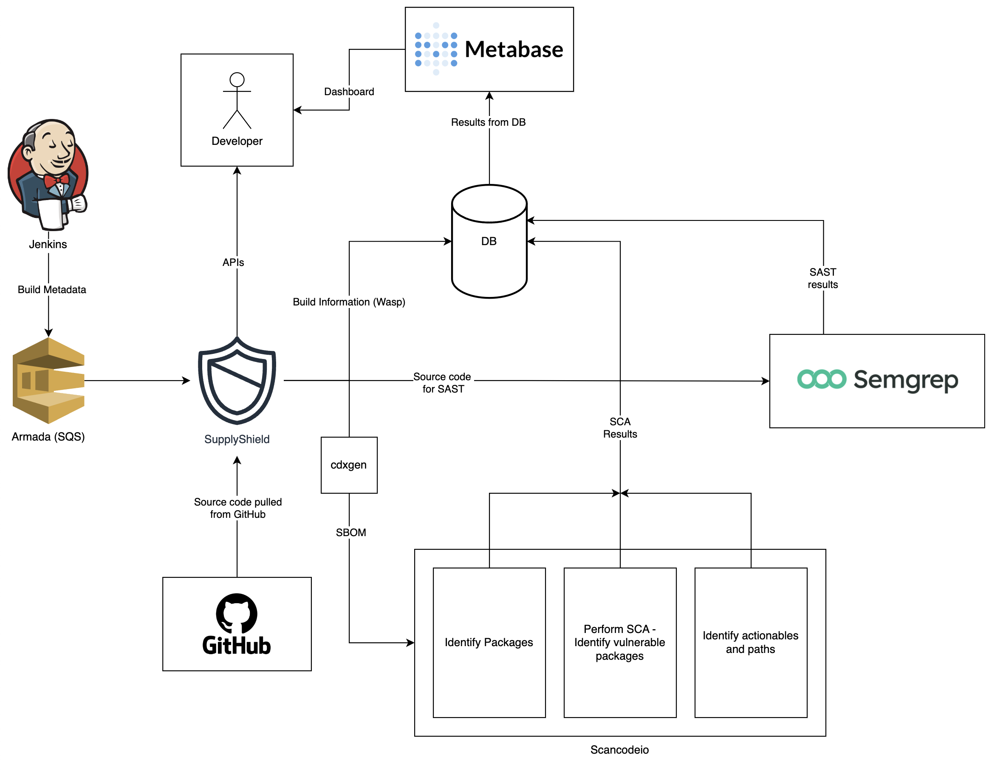

===============
SupplyShield
===============

.. image:: https://github.com/supplyshield/supplyshield/blob/develop/docs/images/logo.png
   :alt: SupplyShield Logo
   :align: center

SupplyShield is an open-source application security orchestration framework designed to secure your software supply chain from vulnerabilities, malicious dependencies, and unapproved base images. It provides a comprehensive solution to automate the detection, prioritization, and resolution of security issues in your open-source dependencies and containerized applications.

|Python 3.10+| |stability-wip|

.. |Python 3.10+| image:: https://img.shields.io/badge/python-3.10+-green.svg
   :target: https://www.python.org/downloads/release/python-3100/
.. |stability-wip| image:: https://img.shields.io/badge/stability-work_in_progress-lightgrey.svg

SupplyShield is under active development, releases are available under the "releases" section on GitHub.

Read more about SupplyShield at `docs <https://supplyshield.readthedocs.io/en/latest/index.html>`_.

Features
^^^^^^^^

- **Software Composition Analysis (SCA):** Identify vulnerabilities in your open-source dependencies using grype and osv.
- **Automated Detection of Untrusted Packages:** Identify malicious open-source packages and prevent supply chain attacks.
- **Automated SBOM Generation:** Track dependencies using tools like cdxgen and syft.
- **Layer-Based Image Scanning:** Detect unauthorized base images and outdated layers in Docker containers.
- **Ownership Resolution:** Leverage graph-based mapping to assign vulnerabilities to the right microservices.
- **Seamless Integration with CI/CD Pipelines:** Automate security checks from development to deployment.

SupplyShield tech stack is Python, Flask, PostgreSQL and Docker and several libraries.

Installation
^^^^^^^^^^^^

SupplyShield can be installed using Docker Compose. The following steps will guide you through the installation process:

**Step 1: Install Docker**

First, you need to have Docker installed on your machine. If you haven't installed Docker yet, you can download it from the official Docker website at https://www.docker.com/get-started and follow the instructions for your operating system.

**Step 2: Get the Source Code**

Clone the repository and navigate to the project directory:

   .. code-block:: bash

      git clone 
      cd supplyshield

**Step 3: Configure the Environment Variables**

Copy `docker.env.sample` to `docker.env` and update the environment variables to match your configuration. The configuration file contains few mandatory variables that need to be set before starting the application.

   .. code-block:: bash
         
         cp docker.env.sample docker.env
   
**Step 4: Run the docker**

Run the following command to start the application:

   .. code-block:: bash

      docker compose up

This will start the SupplyShield application and required services. SupplyShield will now start listening to the configured SQS queue for messages and process them. 

**Step 5: Send a message to the SQS queue**

Sending a message to the SQS queue will trigger the SupplyShield pipeline to start processing the message. The pipeline will generate an SBOM, scan the dependencies, and identify vulnerabilities. Format of the message can be found `here <https://supplyshield.readthedocs.io/en/latest/introduction.html#id1>`_.

Architecture Diagram
^^^^^^^^^^^^^^^^^^^^

The following diagram illustrates the architecture of SupplyShield:

Copyright notice
^^^^^^^^^^^^^^^^^

Copyright (c) SupplyShield and others. All rights reserved.
