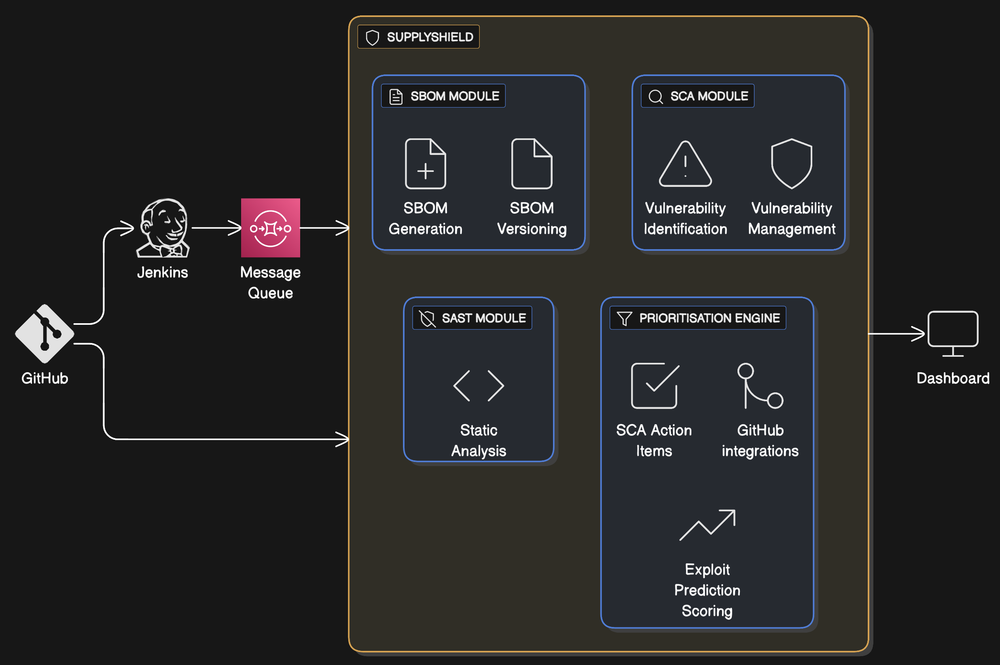

===============
🛡️ SupplyShield
===============

.. image:: https://github.com/supplyshield/supplyshield/blob/develop/docs/images/logo.png
   :alt: SupplyShield Logo
   :align: center

SupplyShield is an open-source application security orchestration framework designed to secure your software supply chain from vulnerabilities, malicious dependencies, and unapproved base images. It provides a comprehensive solution to automate the detection, prioritization, and resolution of security issues in your open-source dependencies and containerized applications.

|Python 3.10+| |stability-wip|

.. |Python 3.10+| image:: https://img.shields.io/badge/python-3.10+-green.svg
   :target: https://www.python.org/downloads/release/python-3100/
.. |stability-wip| image:: https://img.shields.io/badge/stability-work_in_progress-lightgrey.svg

.. note::
   SupplyShield is under active development, releases are available under the "releases" section on GitHub.

📚 Read more about SupplyShield at `docs <https://supplyshield.readthedocs.io/en/latest/index.html>`_.

🚀 Features
^^^^^^^^^^^^
- **Automated SBOM Generation:** Generate Software Bill of Materials (SBOM) using cdxgen with support for multiple package managers (Java, Python, Node.js, Go, and more).
- **Comprehensive Software Composition Analysis (SCA):** Identify vulnerabilities in your open-source dependencies.
- **EPSS-Based Vulnerability Prioritization:** Leverage Exploit Prediction Scoring System (EPSS) to prioritize vulnerabilities based on their likelihood of exploitation.
- **Actionable Security Findings:** Automatically identify safe package versions and provide upgrade recommendations for vulnerable dependencies.
- **GitHub Integration:** Seamless integration for automated issue creation with security findings.
- **CI/CD Pipeline Integration:** Process scan requests from CI/CD pipelines via message queues.
- **Build Comparison:** Compare vulnerabilities and package changes between different builds to track security improvements over time.
- **Repository Management:** Comprehensive repository listing with filtering, statistics, and vulnerability tracking across environments.
- **Multi-Environment Support:** Track and manage security findings across different deployment environments (dev, staging, prod).
- **Docker-Based Architecture:** Fully containerized deployment with Docker Compose for easy setup and scaling.

**Tech Stack:** 🐍 Python | 🌶️ Flask | 🐘 PostgreSQL | 🐳 Docker

🚀 Installation & Setup
^^^^^^^^^^^^^^^^^^^^^^^

Prerequisites
-------------

- Docker and Docker Compose installed on your system
- Git for cloning the repository
- Access to required secrets and credentials (see Configuration section below)

Step 1: Get the Source Code
---------------------------

Clone the repository with all submodules and navigate to the project directory:

.. code-block:: bash

   git clone --recurse-submodules https://github.com/supplyshield/supplyshield/
   cd supplyshield

Step 2: Configure Environment Variables
---------------------------------------

Create a `docker.env` file in the root directory. This file contains all the configuration variables needed for SupplyShield to run.

Required Configuration Variables
~~~~~~~~~~~~~~~~~~~~~~~~~~~~~~~~~

**Database Configuration:**

.. code-block:: bash

   # PostgreSQL Database for ScanCode.io
   POSTGRES_DB=scancodeio
   POSTGRES_USER=scancodeio
   POSTGRES_PASSWORD=scancodeio
   POSTGRES_HOST_AUTH_METHOD=trust
   POSTGRES_INITDB_ARGS=--encoding=UTF-8 --lc-collate=en_US.UTF-8 --lc-ctype=en_US.UTF-8

   # Database configuration for SupplyShield service
   DB_HOSTNAME=db
   DB_USERNAME=scancodeio
   DB_PASSWORD=scancodeio

   # ScanCode.io Database Configuration
   SCANCODEIO_DB_HOST=db
   SCANCODEIO_DB_NAME=scancodeio
   SCANCODEIO_DB_USER=scancodeio
   SCANCODEIO_DB_PASSWORD=scancodeio

   # PurlDB Database Configuration (uses same DB instance, different schema)
   PACKAGEDB_DB_HOST=db
   PACKAGEDB_DB_NAME=packagedb
   PACKAGEDB_DB_USER=scancodeio
   PACKAGEDB_DB_PASSWORD=scancodeio

**AWS Configuration (Required for CI/CD Integration and SBOM Uploads):**

.. code-block:: bash

   AWS_DEFAULT_REGION=ap-south-1
   AWS_ACCESS_KEY_ID=your-access-key-id
   AWS_SECRET_ACCESS_KEY=your-secret-access-key
   S3_BUCKET_NAME=your-s3-bucket-name
   SQS_QUEUE_NAME=your-sqs-queue-name

**GitHub App Configuration (Required for repository cloning and issue creation):**

.. code-block:: bash

   GIT_PROVIDER=github
   GIT_ORG=your-organization
   GITHUB_APP_APP_ID=your-github-app-id
   GITHUB_APP_INSTALLATION_ID=your-installation-id

**Service URLs:**

.. code-block:: bash

   SCANCODEIO_URL=http://scancodeio:8000
   SUPPLYSHIELD_BASE=http://web:5000
   PURLDB_URL=http://purldb:8000
   PURLDB_API_URL=http://purldb:8000/api
   VULNERABLECODE_URL=https://public.vulnerablecode.io/

**Optional Configuration:**

.. code-block:: bash

   # Jira Integration (optional)
   JIRA_URL=https://org_name.atlassian.net
   JIRA_USER=your-email@example.com
   JIRA_TOKEN=your-jira-token

   # Service Metadata URL (optional)
   SERVICE_METADATA_URL=https://your-metapod-url

   # Allowed Hosts
   ALLOWED_HOSTS=scancodeio,your-server-ip

   # Secret Key for Django
   SECRET_KEY=your-secret-key-here

   # Go Private Module Configuration (optional)
   GO_PRIVATE=your-go-private-config

Step 3: Setup GitHub App Private Key
-------------------------------------

SupplyShield requires a GitHub App private key for authenticating with GitHub. Place your private key file at:

.. code-block:: bash

   etc/secrets/github_app_private_key.pem

The private key file should be in PEM format and must match the GitHub App ID configured in `docker.env`.

.. note::
   The GitHub App must have the following permissions:
   - **Contents**: Read (for cloning repositories)
   - **Issues**: Write (for creating/updating issues)
   - **Metadata**: Read (required for all GitHub Apps)

Step 4: Start Services with Docker Compose
------------------------------------------

Start all SupplyShield services:

.. code-block:: bash

   sudo docker compose up -d

This command will start the following services:

- **db**: PostgreSQL database
- **scancode-migrate**: Runs database migrations for ScanCode.io
- **scancodeio**: ScanCode.io service (port 8002)
- **daemon**: SupplyShield daemon service (port 8001)
- **crons**: Scheduled job runner for automated tasks
- **purldb**: PurlDB service for package metadata (port 8003)
- **web**: SupplyShield web interface (port 8000)

Step 5: Verify Installation
----------------------------

Check that all services are running:

.. code-block:: bash

   sudo docker compose ps

All services should show as "Up" or "Healthy". You can also access:

- Web Interface: http://localhost:8000
- ScanCode.io: http://localhost:8002
- PurlDB API: http://localhost:8003

📖 Usage Guide
^^^^^^^^^^^^^^

Scanning a Single Repository
-----------------------------

To scan a single repository, use the `process-message` command. This will:

1. Clone the repository
2. Generate an SBOM (Software Bill of Materials)
3. Scan dependencies for vulnerabilities
4. Store results in the database

**Command Format:**

.. code-block:: bash

   sudo docker compose run --rm daemon libinv process-message '<json-message>'

**Example:**

.. code-block:: bash

   sudo docker compose run --rm daemon libinv process-message '{
     "repository": {
       "url": "https://github.com/org/repo.git",
       "commit": "da80e73b4376a0c8d3c6404f272b8f04e6568f40",
       "tag": "da80e73"
     },
     "job_url": "https://jenkins/job/XYZ/",
     "aws_environment": "prod",
     "buildx_enabled": "1",
     "ecr_image": [],
     "type": "Bridge",
     "timestamp": "2025-11-22-06:52:17"
   }'

**Required JSON Fields:**

- ``repository.url``: Git repository URL (required) - should end with ``.git``
- ``repository.commit``: Git commit SHA (required)
- ``type``: Message type, must be ``"Bridge"`` for repository scanning (required)
- ``timestamp``: Timestamp in format ``"YYYY-MM-DD-HH:MM:SS"`` (required)
- ``aws_environment``: Environment name (required)
- ``job_url``: CI/CD job URL (required)

**Optional JSON Fields:**

- ``repository.tag``: Git tag or branch name (optional)
- ``buildx_enabled``: Whether Docker buildx is enabled (optional, default: ``"1"``)
- ``ecr_image``: List of ECR images (optional, default: ``[]``)

**With Debug Output:**

.. code-block:: bash

   sudo docker compose run --rm daemon libinv --debug process-message '<json-message>'

Finding secure versions for vulnerable packages
------------------------------------------------

**Populate Actionable PURL Versions:**

Fetch and store available versions for actionable packages:

.. code-block:: bash

   sudo docker compose run --rm daemon libinv populate-actionable-purl-versions

**Scan Versions in Use:**

Scan all package versions currently in use:

.. code-block:: bash

   sudo docker compose run --rm daemon libinv --debug scan-versions-in-use

**Scan Latest Versions:**

Scan the latest version for packages that don't have a known safe version:

.. code-block:: bash

   sudo docker compose run --rm daemon libinv --debug scan-latest-versions

**Populate Next Safe Versions:**

Find and populate the closest safe version for each vulnerable package:

.. code-block:: bash

   sudo docker compose run --rm daemon libinv --debug populate-next-safe-versions

Updating EPSS Scores
--------------------

EPSS (Exploit Prediction Scoring System) scores help prioritize vulnerabilities based on their likelihood of exploitation. SupplyShield can update EPSS scores for CVEs.

**Update EPSS for All Actionable CVEs:**

This command updates EPSS scores for all CVEs found in actionable packages:

.. code-block:: bash

   sudo docker compose run --rm daemon libinv --debug epss-update --all-actionable-cves

**Calculate Package EPSS Scores:**

After updating EPSS scores for CVEs, calculate the maximum EPSS score for each package:

.. code-block:: bash

   sudo docker compose run --rm daemon libinv --debug calculate-package-epss

This command:

1. Gets all packages with successful scans
2. Extracts CVEs for each package
3. Finds the maximum EPSS score from those CVEs
4. Updates the package record with the max EPSS score

Raising Security Issues as Git Issues
---------------------------------------

SupplyShield can automatically create or update GitHub issues with actionable security findings for repositories.

**Prerequisites:**

- The repository must already be scanned (use `process-message` first)
- The repository must have Issues enabled in GitHub
- GitHub App must have "Issues: Write" permission

**Command Format:**

.. code-block:: bash

   sudo docker compose run --rm daemon libinv raise-sca-as-git-issue "<repository-url>"

**Example:**

.. code-block:: bash

   sudo docker compose run --rm daemon libinv raise-sca-as-git-issue "https://github.com/org/repo.git"

**With Debug Output:**

.. code-block:: bash

   sudo docker compose run --rm daemon libinv --debug raise-sca-as-git-issue "https://github.com/org/repo.git"

**What This Command Does:**

1. Finds the repository in the database
2. Identifies actionable security findings (vulnerable packages)
3. Creates or updates a GitHub issue with:
   - List of vulnerable packages
   - Current versions in use
   - Recommended safe versions
   - EPSS scores for prioritization
   - Package details and upgrade paths

**Troubleshooting:**

- If you get "Issues has been disabled in this repository", enable Issues in the repository settings
- If you get "Couldn't find <url> in database", scan the repository first using `process-message`
- Check GitHub App permissions to ensure "Issues: Write" is enabled

Scheduled Jobs
--------------

The `crons` service automatically runs scheduled jobs configured in `docker-compose.yml`. These jobs include:

- **populate_actionable_purl_versions**: Fetches available versions for actionable packages (every 2 days)
- **update_latest_version_tag**: Tags the latest version for each package (every 2 days)
- **scan_versions_in_use**: Scans all package versions currently in use (every 2 days)
- **scan_latest_versions**: Scans latest versions for packages without safe versions (every 2 days)
- **populate_next_safe_versions**: Finds closest safe versions (every 2 days)
- **epss_update**: Updates EPSS scores for all actionable CVEs (daily)
- **calculate_package_epss**: Calculates package EPSS scores (daily)

These jobs run automatically and don't require manual intervention.

🏗️ Architecture Diagram
^^^^^^^^^^^^^^^^^^^^^^^

The following diagram illustrates the architecture of SupplyShield:

👥 Contributors
^^^^^^^^^^^^^^^

- Akhil Mahendra
- Hritik Vijay
- Rahul Sunder
- Roshan Kumar
- Yadhu Krishna M

.. note::
   We welcome contributions! If you'd like to contribute to SupplyShield, please check out our documentation and feel free to submit issues or pull requests.

📄 Copyright notice
^^^^^^^^^^^^^^^^^^

Copyright (c) SupplyShield and others. All rights reserved.
